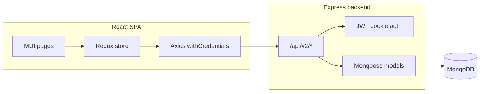

# MyFleet 2.0

Fleet and delivery operations dashboard: manage customers, contractors, drivers, vehicles, jobs, rates, expenses, and analytics for a transport company (**deliverer**).

**Stack:** React (Create React App) + Material UI + Redux Toolkit · Express · MongoDB (Mongoose) · JWT auth (httpOnly cookie).

**Full technical reference:** [docs/PROJECT_REFERENCE.md](docs/PROJECT_REFERENCE.md)

**Package READMEs:** [frontend/README.md](frontend/README.md) · [backend/README.md](backend/README.md)

---

## Prerequisites

- **Node.js** (LTS recommended; matches CRA 5 and Express 4)
- **MongoDB** (local or Atlas) and a connection string
- **npm**

---

## Quick start (local development)

### 1. MongoDB

Start MongoDB locally or create a cluster and note the connection string.

### 2. Backend environment

From the repo root:

```bash
cd backend
```

Create **`config/.env`** (this path is gitignored). Copy variable names from [backend/config/.env.example](backend/config/.env.example).

**Important:** load env by running commands with **current working directory = `backend/`**, so `config/.env` resolves to `backend/config/.env`. See [docs/PROJECT_REFERENCE.md](docs/PROJECT_REFERENCE.md#71-where-env-is-loaded).

Set at least:

- **`PORT=5050`** (must match [frontend/src/server.js](frontend/src/server.js))
- **`OFFLINE_DB_URL`** — your Mongo connection string for development
- **`JWT_SECRET_KEY`**, **`JWT_EXPIRES`**, **`ACTIVATION_SECRET`**
- **`SMPT_*`** variables if you use email activation (spellings match code: `SMPT_`)

### 3. Install and run API

```bash
cd backend
npm install
npm run dev
```

The server logs the port (for example `http://localhost:5050`).

### 4. Install and run frontend

In a **second** terminal:

```bash
cd frontend
npm install
npm start
```

Open [http://localhost:3000](http://localhost:3000). The app calls the API at **`http://localhost:5050/api/v2`** with credentials (cookies).

---

## Architecture (overview)



---

## npm scripts (repository root)

| Script | Description |
|--------|-------------|
| **`npm run dev`** | Runs `nodemon backend/server.js` from **repo root**. Note: dotenv may look for **`./config/.env` at repo root** unless you only use `backend/` as cwd. Prefer **`cd backend && npm run dev`** for local API. |
| **`npm start`** | Runs `node backend/server.js` (same cwd consideration). |
| **`npm run build`** | Installs root + frontend dependencies and runs **`npm run build`** in **`frontend/`** (production bundle). |

---

## Production-style run (API + built SPA)

1. Build the frontend: `cd frontend && npm install && npm run build`
2. Ensure **`frontend/build`** exists at the path expected by [backend/app.js](backend/app.js) (relative to where you start Node).
3. Set **`NODE_ENV=production`**, **`DB_URL`**, and other secrets on the host.
4. Start the server from a cwd where static and API paths resolve correctly (see [docs/PROJECT_REFERENCE.md](docs/PROJECT_REFERENCE.md#9-build-and-deployment-notes)).

---

## Deploy both apps on Vercel (single project)

Repo root ships:

- **`vercel.json`** — installs `frontend` + `backend`, builds the CRA app into **`frontend/build`**, and routes **`/api/*`** to a serverless **`api/index.js`** entry that runs the Express app.
- **`api/index.js`** — connects MongoDB and exports [backend/app.js](backend/app.js).

Import the repo in Vercel with **project root** = repository root (no subdirectory). Override install/build commands only if needed; defaults come from **`vercel.json`**.

### Environment variables on Vercel

| Scope | Variables |
|--------|-----------|
| **Build** (CRA) | **`REACT_APP_API_ORIGIN`** — leave unset for same-origin deployments so requests use **`/api/v2`**. Only set when the browser must call another host (full origin, no trailing slash), e.g. `https://api.example.com`. |
| **Runtime** (API) | **`DB_URL`** — Atlas or other Mongo URI (`NODE_ENV=production` selects this — see [backend/db/Database.js](backend/db/Database.js)). **JWT_SECRET_KEY**, **JWT_EXPIRES**, **ACTIVATION_SECRET**, **FRONTEND_URL** (must match where users open the SPA; used in emailed links). **Optional:** comma-separated **`ALLOWED_ORIGINS`** instead of/over **`FRONTEND_URL`** for CORS. SMTP: **`SMPT_HOST`**, **`SMPT_PORT`**, **`SMPT_SERVICE`**, **`SMPT_MAIL`**, **`SMPT_PASSWORD`**. **`PORT`** is ignored on Vercel. |

MongoDB Atlas: allow **`0.0.0.0/0`** (or Vercel’s documented egress IPs) because serverless invocations move between addresses.

### Limitations on Vercel

- Uploaded files land in **`/tmp`** ([backend/uploadsDir.js](backend/uploadsDir.js)) and are **ephemeral**. For persistent documents or images use object storage (S3, Blob, Cloudinary).
- Long-running workloads and traditional WebSockets are not a fit for `/api`; this stack uses polling/HTTP cookies only.

Same reference for naming: [backend/config/.env.example](backend/config/.env.example).

---

## License
ISC (see package.json author field).
