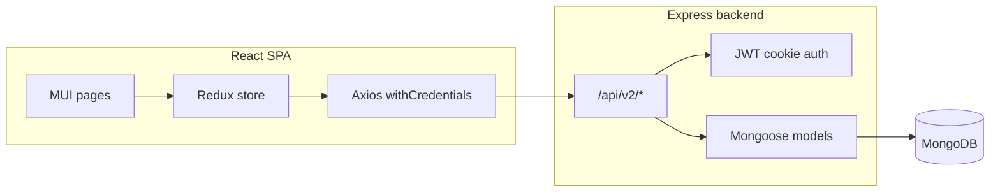

# MyFleet 2.0 — Project reference

This document is the technical companion to the repository. For day-one setup, see the root [README.md](../README.md) and the package-level READMEs in [frontend/README.md](../frontend/README.md) and [backend/README.md](../backend/README.md).

---

## 1. What the system does

**MyFleet** is a **delivery and fleet operations** web application. It lets a **deliverer** (transport company) manage:

- **Company profile** (deliverer entity): goods types, vehicle types, delivery types, and rate tables used for pricing.
- **People and partners**: **users** (admins and staff with roles), **customers** (shippers), **contractors**, and **drivers**.
- **Fleet**: **vehicles** assigned to the business.
- **Jobs / orders**: each job links customer, origin, distance, cost, mileage in/out, dates, delivery type, and assignments (**contractor**, **vehicle**, **driver**).
- **Analytics and reporting**: aggregated **overall**, **vehicle**, **driver**, and **contractor** statistics used by dashboard charts and reports.
- **Expenses**: **vehicle** and **employee** expenses tracked alongside operations.

The **frontend** is a single-page React app (Material UI, Redux, charts). The **backend** is a REST API on Express, persisting data in **MongoDB** via **Mongoose**.

---

## 2. High-level architecture



- **Browser** → React (port **3000** in dev) → **Axios** calls `http://localhost:5050/api/v2/...` (see [frontend/src/server.js](../frontend/src/server.js)); `withCredentials: true` sends cookies.
- **Express** ([backend/app.js](../backend/app.js)) mounts routers under **`/api/v2`**, applies **CORS** for `http://localhost:3000`, serves **`/uploads`** as static files, and in production serves **`frontend/build`** for non-API routes.
- **Auth**: JWT stored in **httpOnly** cookie `token`; verified in [backend/middleware/auth.js](../backend/middleware/auth.js).

---

## 3. Repository layout

```
myfleet/
├── backend/                 # Express API + Mongoose
│   ├── app.js               # Express app, CORS, routes, static SPA + uploads
│   ├── server.js            # dotenv, DB connect, listen(PORT)
│   ├── config/              # .env lives here (gitignored); see .env.example
│   ├── controller/          # Route handlers per domain
│   ├── db/
│   │   └── Database.js      # mongoose.connect
│   ├── middleware/          # auth, errors, catchAsync
│   ├── model/               # Mongoose schemas
│   ├── uploads/             # Multer file storage (relative to process cwd)
│   ├── utils/               # JWT cookie helper, mailer, ErrorHandler
│   ├── multer.js
│   ├── populateStats.js     # Standalone stats aggregation script (hardcoded DB URI)
│   └── popstats2.0.js       # Variant / experiment (hardcoded DB URI)
├── frontend/                # Create React App
│   ├── public/
│   └── src/
│       ├── App.js           # Routes, layout, initial Redux dispatches
│       ├── component/       # UI components (deliverer-focused)
│       ├── pages/           # Page-level screens
│       ├── redux/           # actions, reducers, store
│       ├── route/           # route exports, protected wrapper
│       ├── providers/
│       ├── theme.js
│       └── server.js        # API base URL (must match backend PORT)
├── docs/                    # This reference
├── package.json             # Root scripts; optional superset of backend deps
├── backend/package.json     # Minimal backend dependency set used by backend code
└── frontend/package.json    # React app dependencies
```

### 3.1 Backend (`backend/`)

| Area | Role |
|------|------|
| **app.js** | Registers `cors`, `cookie-parser`, JSON body, static `/uploads`, mounts all **`/api/v2/*`** routers, global error handler, serves **`frontend/build`** for `GET *`. |
| **server.js** | Loads dotenv (non-production), connects DB, starts HTTP server on **`process.env.PORT`**. |
| **controller/*.js** | Express `Router` instances: HTTP endpoints per resource. Large files (e.g. **job.js**) contain many list/filter/update endpoints for orders and analytics slices. |
| **model/*.js** | Mongoose models — source of truth for fields and refs. |
| **middleware/auth.js** | **`isAuthenticated`**: reads `token` cookie, verifies JWT, attaches `req.user`. |
| **middleware/error.js** | Centralized error handling. |
| **utils/jwtToken.js** | Sets httpOnly **`token`** cookie on login responses. |
| **utils/sendMail.js** | Nodemailer transporter using **`SMPT_*`** env vars (spelling matches code). |
| **multer.js** | Disk storage under **`uploads/`** with generated filenames. |

**Offline stats scripts**: [populateStats.js](../backend/controller/populateStats.js) and [popstats2.0.js](../backend/controller/popstats2.0.js) are **not** wired into `app.js`. They connect to Mongo with **hardcoded** `mongodb://localhost:27017/...` URIs and are intended for **manual / one-off** aggregation or migration work. Update URIs and run with Node only if you use them.

### 3.2 Frontend (`frontend/src/`)

| Area | Role |
|------|------|
| **App.js** | `BrowserRouter`, MUI theme, **`DelLayout`**, routes for dashboard, vehicles, drivers, customers, contractors, jobs, analytics, reports, login/register, activation. |
| **route/delRoutes.js** | Lazy or direct exports of page components. |
| **route/delProtectedRoutes.js** | Wrapper around authenticated pages (intended pattern; verify behavior matches product expectations). |
| **redux/** | **configureStore** combines `global`, `user`, customers, contractors, vehicles, deliverers, drivers, jobs, rates, overallStats, vehicleStats, driverStats, contractorStats, expenses. |
| **pages/deliverer/** | Main deliverer UI: dashboards, analytics, reports, CRUD pages. |
| **component/deliverer/** | Shared layout, charts (Nivo), grids, popups. |

---

## 4. Data model (MongoDB collections)

Each file in [backend/model/](../backend/model/) maps to a collection (Mongoose pluralization rules apply).

| Model file | Purpose |
|------------|---------|
| **user.js** | Accounts: name, email, hashed password, phone, **role**, address, city, **companyId** (deliverer scope). JWT via `getJwtToken()`. |
| **deliverer.js** | Company: name, address, city, **goodsType**, **vehiclesType**, **deliveryType**, embedded **Rates**, references to jobs and related entities. |
| **customer.js** | Customers tied to the deliverer workflow. |
| **contractor.js** | Third-party or partner contractors. |
| **driver.js** | Drivers. |
| **vehicle.js** | Vehicles. |
| **job.js** | Orders: job number, from/customer refs, distance, **cost** (Decimal128), mileage, dates, description, **deliveryType**, **contractorId**, **vehicleId**, **driverId**. |
| **rate.js** | Rate configuration used by the app. |
| **payment.js** | Payment records (as modeled in app). |
| **overallStats.js** | Company-wide aggregated metrics. |
| **vehicleStats.js** | Per-vehicle aggregates. |
| **driverStats.js** | Per-driver aggregates. |
| **contractorStats.js** | Per-contractor aggregates. |
| **vehicleExpense.js** | Vehicle expense lines. |
| **employeeExpenses.js** | Employee expense lines. |

Relationships are primarily via **ObjectId** references (see **job.js** for the canonical assignment graph).

---

## 5. HTTP API surface

All JSON APIs are prefixed with **`/api/v2`**.

| Mount path | Controller file | Domain |
|------------|-------------------|--------|
| `/api/v2/user` | user.js | Registration, activation email, login/logout, profile, admin listing and updates |
| `/api/v2/customer` | customer.js | Customer CRUD and paged lists |
| `/api/v2/deliverer` | deliverer.js | Deliverer profile CRUD |
| `/api/v2/contractor` | contractor.js | Contractor CRUD |
| `/api/v2/vehicle` | vehicle.js | Vehicle CRUD |
| `/api/v2/driver` | driver.js | Driver CRUD, paged driver lists |
| `/api/v2/job` | job.js | Job create/update/delete, many GET endpoints for dashboards and filters |
| `/api/v2/rate` | rate.js | Rate fetch/update patterns |
| `/api/v2/overallStats` | overallStats.js | Overall statistics reads |
| `/api/v2/vehicleStats` | vehicleStats.js | Vehicle statistics reads |
| `/api/v2/driverStats` | driverStats.js | Driver statistics reads |
| `/api/v2/contractorStats` | contractorStats.js | Contractor statistics reads |
| `/api/v2/expenses/vehicle` | vehicleExpenses.js | Vehicle expenses |
| `/api/v2/expenses/employee` | employeeExpenses.js | Employee expenses |

**Static and SPA**

- **`GET /uploads/*`**: files saved by Multer (path configured relative to server cwd).
- **`GET *`** (non-API): returns **`frontend/build/index.html`** when that folder exists (typical production layout).

For exact paths and query parameters, inspect the corresponding **`router.get/post/...`** definitions in each controller.

---

## 6. Authentication and security

1. **Login** responses use [utils/jwtToken.js](../backend/utils/jwtToken.js) to set a **`token`** cookie (**httpOnly**, **sameSite: `none`**, **secure: true**).
2. **Secure cookies** normally require **HTTPS**. On plain **http://localhost**, browsers may **not** store the cookie, which breaks auth in dev unless you use HTTPS locally or adjust cookie options (a known integration point).
3. Protected routes use **`isAuthenticated`** from [middleware/auth.js](../backend/middleware/auth.js), which expects **`process.env.JWT_SECRET_KEY`** to match signing.
4. **User activation** uses **`ACTIVATION_SECRET`** and emails containing a link; the activation URL host is **hardcoded** in [controller/user.js](../backend/controller/user.js) — change it for your deployment.

---

## 7. Environment variables and runtime pitfalls

### 7.1 Where `.env` is loaded

- [server.js](../backend/server.js) and [app.js](../backend/app.js) call `dotenv.config({ path: "config/.env" })` when **`NODE_ENV !== "PRODUCTION"`** (note: **`PRODUCTION`** in all caps).
- That path is **relative to the current working directory** of the Node process, **not** always the `backend/` folder.
- [.gitignore](../.gitignore) ignores **`backend/config/.env`**, which matches **`config/.env`** when you **`cd backend`** before `node server.js` or `npm run dev`.

**Recommendation:** start the API from **`backend/`** so a single file **`backend/config/.env`** is used. If you run `nodemon backend/server.js` from the **repo root**, Node looks for **`./config/.env` at the repo root** unless you change the script or dotenv path.

### 7.2 Database URL selection

[db/Database.js](../backend/db/Database.js):

- If **`NODE_ENV === "production"`** (lowercase), uses **`DB_URL`**.
- Otherwise uses **`OFFLINE_DB_URL`**.

Because **`production`** vs **`PRODUCTION`** differ, be explicit: for local dev, leave **`NODE_ENV`** unset or not `production`, and set **`OFFLINE_DB_URL`**. For production, set **`NODE_ENV=production`** and **`DB_URL`**.

### 7.3 Variables referenced in code

| Variable | Used for |
|----------|----------|
| **PORT** | HTTP listen port (align with [frontend/src/server.js](../frontend/src/server.js), e.g. **5050**). |
| **OFFLINE_DB_URL** | Mongo connection string in non-production. |
| **DB_URL** | Mongo connection string when `NODE_ENV === "production"`. |
| **JWT_SECRET_KEY** | Signing and verifying access JWT. |
| **JWT_EXPIRES** | JWT expiry expression (passed to `jwt.sign`). |
| **ACTIVATION_SECRET** | Short-lived activation JWT for new users. |
| **SMPT_HOST**, **SMPT_PORT**, **SMPT_SERVICE**, **SMPT_MAIL**, **SMPT_PASSWORD** | Nodemailer (spellings are **SMPT** in code). |

See [backend/config/.env.example](../backend/config/.env.example) for a copy-paste template.

### 7.4 CORS

[app.js](../backend/app.js) sets **`origin: "http://localhost:3000"`** with **`credentials: true`**. Other origins are commented (e.g. Vercel / Render). Update **`origin`** for your frontend URL in each environment.

---

## 8. Dependencies and two `package.json` files

- **[backend/package.json](../backend/package.json)** lists what the **backend JavaScript** actually `require`s today.
- **[package.json](../package.json)** (root) adds packages such as **socket.io**, **googleapis**, and **handlebars**; they are **not** required by the current `backend/*.js` entrypoints reviewed for this doc. Prefer **`npm install` inside `backend/`** for a minimal API install, or use the root install if you standardize on one lockfile for CI.

---

## 9. Build and deployment notes

1. **Frontend**: `npm run build` in **`frontend/`** → output **`frontend/build/`**.
2. **Backend**: when `app.js` resolves **`./frontend/build`** from the process cwd, deploying **API + static build** together usually means running Node from the **repository root** with **`frontend/build`** present, **or** adjusting paths.
3. **User emails**: update activation base URL and SMTP credentials per environment.
4. **MongoDB**: ensure network access and TLS settings match your connection string for hosted databases.

---

## 10. Backups and data dumps

JSON exports sometimes live under folders such as **`db-backup-*`** in the repo (example snapshots). Treat them as **data**, not application code; avoid committing secrets or production PII.

---

## 11. Related documents

- [README.md](../README.md) — quick start and scripts  
- [frontend/README.md](../frontend/README.md) — React app  
- [backend/README.md](../backend/README.md) — API and env  
